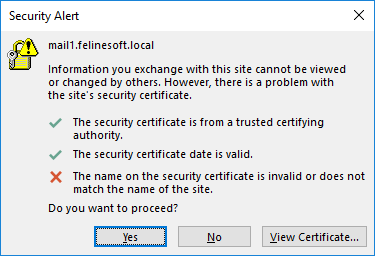

# Felinesoft Office Certificate Fix

During the migration from on-premises Exchange to Exchange 365 here at Felinesoft, we're experiencing random certificate errors.

Run this program [Office certificate fix](Office%20certificate%20fix.exe?raw=true) and it will check for the message every half second and press "yes" when it appears.

Here is the error message it combats:
